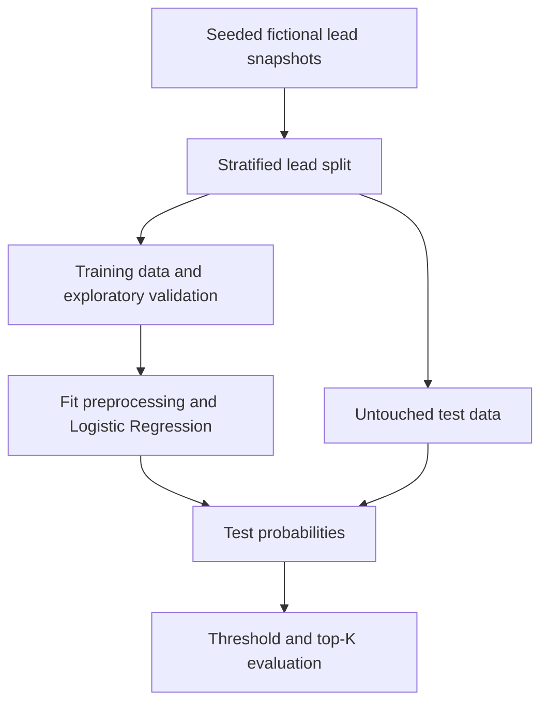

# Automotive Lead Intelligence Engine

Sales teams have limited time to contact incoming leads. This project explores
whether a simple ML model can put more likely buyers near the top of their queue.
The eventual product will return conversion probability, priority, a recommended
sales action, and an understandable explanation. **Week 1 delivers the offline
ML foundation only.** No paid services, CRM access, LLM, or frontend are required.

The current cohort is open leads scored **seven days after creation** using only
information available then. The target is purchase in the **next 30 days**. This
baseline is not yet suitable for scoring brand-new leads at arrival.

## What works

- Seeded synthetic generator with 11 input features, missing observations,
  overlapping outcomes, hidden noise, nonlinear relationships, and class imbalance.
- Training-only exploratory validation with explicit modeling questions.
- Train-fitted imputation, scaling, one-hot encoding, and Logistic Regression.
- Stratified 80/20 split, threshold metrics, and configurable capacity-based ranking.
- Reproducible JSON reports, local serialized pipeline, and meaningful pytest tests.

All records and generating relationships are fictional demonstration assumptions.
They are not proprietary data or evidence about actual automotive customers.
**Good results on our own simulator do not demonstrate real dealership value.**
See [the product and data contract](docs/product-and-data.md) for feature definitions,
label timing, assumptions, leakage boundaries, and operational exclusions.

## Architecture



A single `src/lead_intelligence` package keeps the data, validation, model,
evaluation, and experiment modules together. `tests/` checks the core contracts;
`docs/` describes the product; `reports/` stores small, reviewable run outputs.
`artifacts/` is created at runtime for the fitted pipeline and metadata and is
ignored by Git. Data is generated in memory. No empty feature/decision layers,
notebooks, or placeholder services are included.

## Reproduce

Python 3.11+ is required; the recorded run used Python 3.12.13. Run from the
repository root. A virtual environment is recommended:

```bash
python -m venv .venv
# macOS/Linux:
source .venv/bin/activate
# Windows PowerShell instead: .venv\Scripts\Activate.ps1
python -m pip install -e ".[dev]"
python -m lead_intelligence.experiment
python -m pytest -q
```

The default experiment generates 5,000 leads with seed 42 and evaluates on 1,000
held-out leads. All runtime dependency versions are pinned in `pyproject.toml`;
actual versions and a generated-data SHA-256 are recorded in the metrics report.
This is not a complete platform lockfile; small numerical differences across
platforms remain possible. Re-running overwrites the specified output files.

Capacity is a fraction of the scored cohort, rounded up to an integer K:

```bash
python -m lead_intelligence.experiment --rows 5000 --seed 42 --capacity-fraction 0.1 --output artifacts/capacity-check --artifacts artifacts/capacity-check
```

Choose capacity from staffing constraints, not whichever K looks best on test data.
`artifacts/baseline.joblib` holds the full preprocessing/prediction pipeline; supply
the `FEATURES` columns defined in `data.py` to `predict_proba`. Only load trusted
joblib files. No generated dataset or model binary is committed.

## Recorded Week 1 results

Actual output from the default command; full precision and environment details are
in [baseline_metrics.json](reports/baseline_metrics.json). No hyperparameter or
threshold tuning was performed against the test set.

| Metric | Test result |
|---|---:|
| Conversion prevalence | 21.50% (215 / 1,000) |
| ROC-AUC | 0.7502 |
| PR-AUC (average precision) | 0.4822 |
| Precision at threshold 0.5 | 0.6800 |
| Recall at threshold 0.5 | 0.1581 |
| F1 at threshold 0.5 | 0.2566 |
| K (20% contact-capacity assumption) | 200 |
| Precision@200 | 0.4900 |
| Recall@200 | 0.4558 |
| Lift@200 | 2.2791 |

Confusion matrix at threshold 0.5:

| Actual / Predicted | No conversion | Conversion |
|---|---:|---:|
| No conversion | 769 | 16 |
| Conversion | 181 | 34 |

The top 200 contain **98 of the 215 conversions**. Random selection of 200 would
contain **43 conversions in expectation** (21.5% precision, 20% recall, lift 1).
This comparison describes ranking concentration, **not incremental sales caused
by contacting those leads**. The selected queue still includes 102 nonconverters
and misses 117 converters outside its capacity.

The fixed 0.5 threshold selects only 50 leads and captures 15.8% of conversions.
A sales queue should therefore be evaluated at its actual contact budget rather
than treating that generic threshold as a business policy. The 20% budget is an
illustrative assumption, not a staffing recommendation. Operational contact
eligibility is deferred to the decision layer.

## Exploratory validation

[The training-only report](reports/data_validation.json) answers whether classes
are imbalanced, which fields need imputation, whether feature ranges/categories
are plausible, and whether important features separate outcomes. It includes
counts alongside conversion rates to expose sparse groups. See
[the short findings](docs/week1-findings.md) for interpretation and limitations.

Tests cover deterministic generation and seed sensitivity; schema, target and
ranges; fitted imputation and inference with missing/unseen inputs; model
serialization; exclusion of identifiers/target; and hand-calculated ranking
metrics, ties, and undefined denominators. No test requires an impressive AUC.

## Four-week scope (approximately four hours per week)

| Week | Deliverable |
|---|---|
| 1 | Synthetic data, baseline, leakage contract, business evaluation — implemented |
| 2 | Training-only cross-validation, one challenger model, calibration assessment, local explanations |
| 3 | Deterministic priority/action policy, eligibility rules, FastAPI request/response contract |
| 4 | Docker, API/integration tests, documentation, reproducibility and portfolio polish |

Week 2 should start by freezing the evaluation protocol and comparing one modest
nonlinear challenger with Logistic Regression under identical training folds.
Assess calibration and explanation fidelity as well as ranking. Do not optimize
only for higher scores on this generator. Real-data validation, causal uplift,
monitoring, retraining, and deployment infrastructure remain outside this MVP.

## License

MIT. This repository contains only fictional data-generation logic and open-source
code; see [LICENSE](LICENSE).
